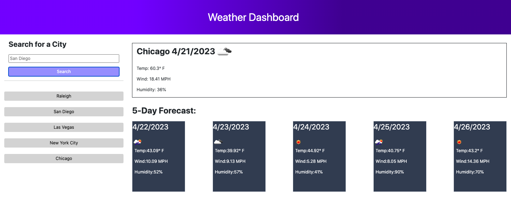

# Weather App 
Use this weather app to search for any major city's weather in the United States. It will display today's weather along with a 5-day forecast. See the Instructions on how to use this call app.

## Instructions
There are two ways to search for a city:
1. The first way is to type in a city in the search bar and click on Search. Once this is completed, after you refresh, your search history will appear under the search button.
2. If you want to search a previously searched city, click on the button with the name of the city you want to see the weather for, and it will search that city's weather!

## Credits
All code created by anicrob. Used OpenWeather.org API to get the weather data along with Bootstrap and jQuery. Architecture assitance from tutor at UNC.

## Screenshots

## Link to Repo and Deployed Application
Repo Link: https://github.com/anicrob/weather-app-6

Deployed Application: https://anicrob.github.io/weather-app-6/ 